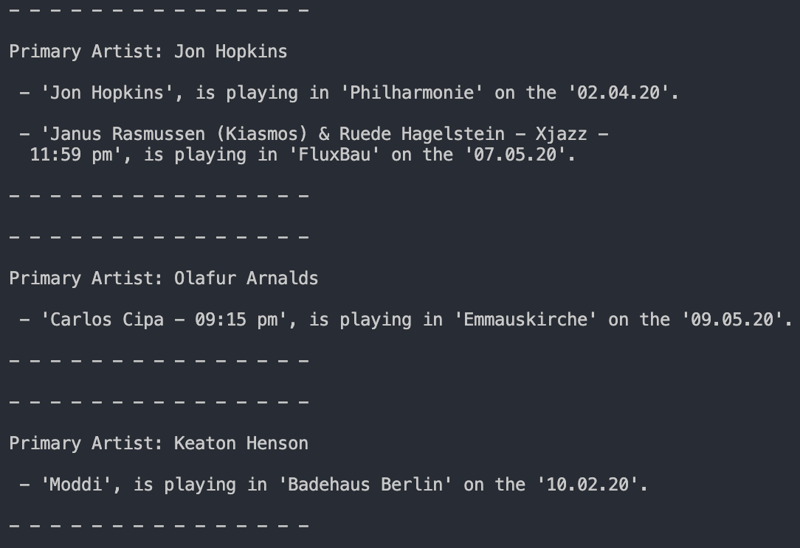

# berlingigfinder
Based on your taste, Find gigs in Berlin for artists you know you already like and allow us suggest gigs for artists you might love.

# Setup
- run `pipenv install` and enter the shell `pipenv shell`
- Make a copy of example_favourite_artists.json and name it 'favourite_artists.json'
- Add your own favourite artists
- run the code `python main.py`

# Example Output

The following is an example of the sort of recommendations made by berling gig finder:
